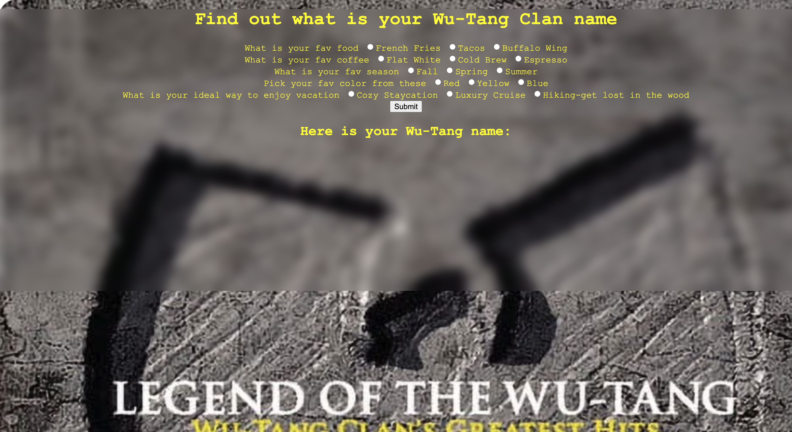
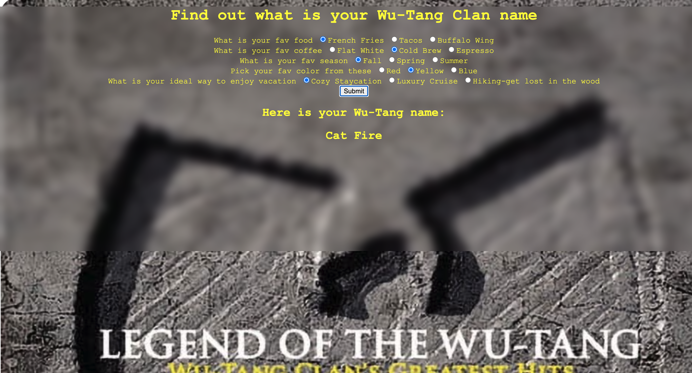

# Wu-Tang Name Generator

A Wu-Tang Clan name generator built with Node.js. 
Users would answer five mulitiple choice questions and from their choices, it would show what their Wu-Tang name is.

- Screenshots:




## How It's Made
**Tech Used:** HTML, CSS, JavaScript, Node.js


## Getting Started

1. Clone this repository

```bash
   git clone https://github.com/sabrinalindev/wu-tang-generator.git
   cd wu-tang-generator
```

2. Start the server

```bash
   node server.js
```

3. Open `http://localhost:8000` in your browser

## How to Use

1. Answer the 5 survey questions
2. Submit your answers
3. Get your randomly generated Wu-Tang name!

## Features

- 5-question survey that shapes the generated name
- Randomized Wu-Tang sounding names

## Future Improvements

-  Add a share button for the generated name
-  Improve the visual design with a Wu-Tang inspired theme

